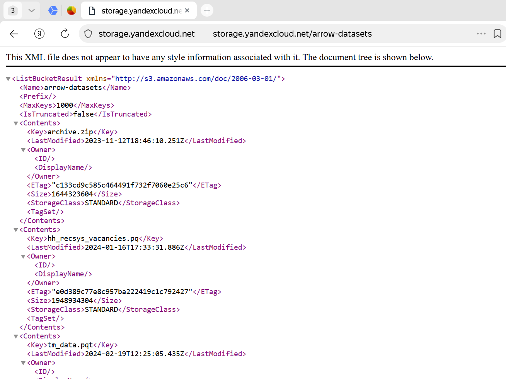
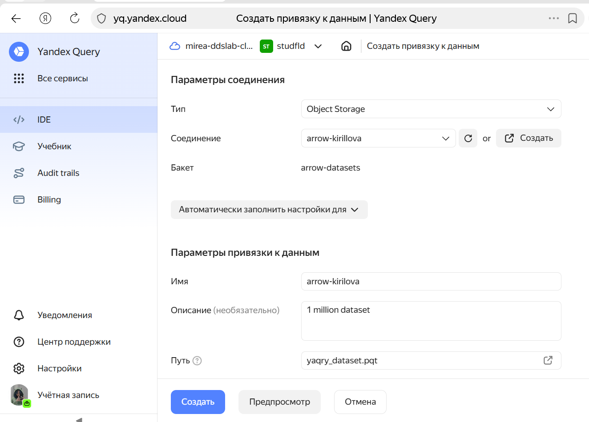
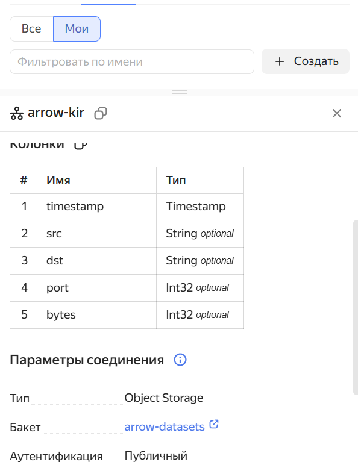
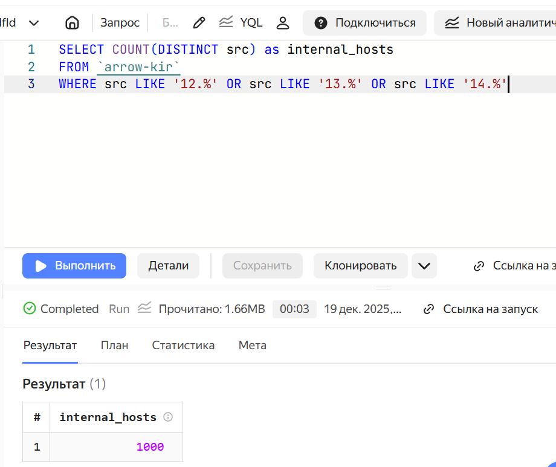
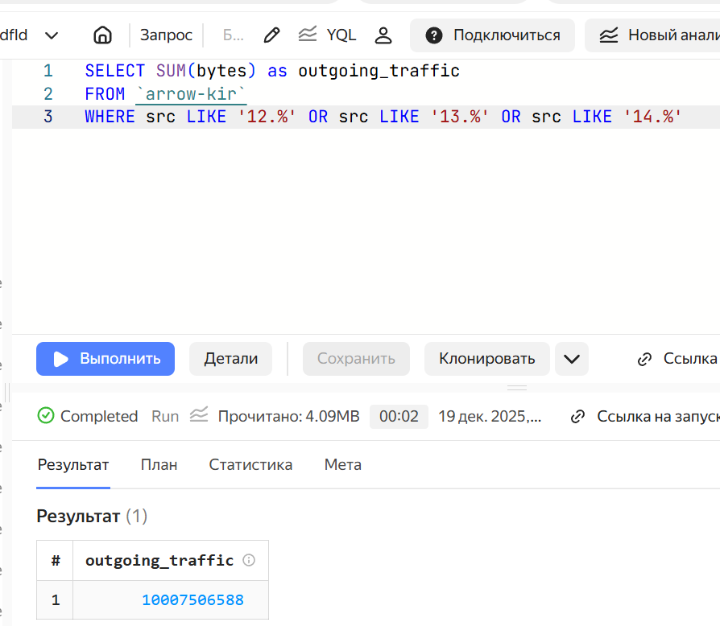
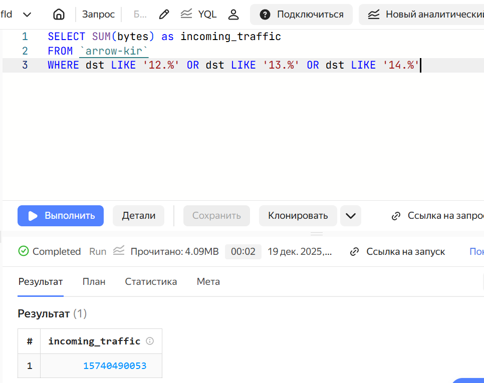

# Использование технологии Yandex Query для анализа данных сетевой
активности


## Цель работы

1.  Изучить возможности технологии Yandex Query для анализа
    структурированных наборов данных
2.  Получить навыки построения аналитического пайплайна для анализа
    данных с помощью сервисов Yandex Cloud
3.  Закрепить практические навыки использования SQL для анализа данных
    сетевой активности в сегментированной корпоративной сети

## Исходные данные

1.  Облачное решение для анализа данных Yandex Query

## План

1.  Проверить доступность данных в Yandex Object Storage
2.  Подключить бакет как источник данных для Yandex Query
3.  Провести анлиз данных

## Шаги:

``` r
sessionInfo()
```

    R version 4.5.1 (2025-06-13 ucrt)
    Platform: x86_64-w64-mingw32/x64
    Running under: Windows 11 x64 (build 26100)

    Matrix products: default
      LAPACK version 3.12.1

    locale:
    [1] LC_COLLATE=Russian_Russia.utf8  LC_CTYPE=Russian_Russia.utf8   
    [3] LC_MONETARY=Russian_Russia.utf8 LC_NUMERIC=C                   
    [5] LC_TIME=Russian_Russia.utf8    

    time zone: Europe/Moscow
    tzcode source: internal

    attached base packages:
    [1] stats     graphics  grDevices utils     datasets  methods   base     

    loaded via a namespace (and not attached):
     [1] compiler_4.5.1    fastmap_1.2.0     cli_3.6.5         tools_4.5.1      
     [5] htmltools_0.5.8.1 rstudioapi_0.17.1 yaml_2.3.10       rmarkdown_2.30   
     [9] knitr_1.50        jsonlite_2.0.0    xfun_0.53         digest_0.6.37    
    [13] rlang_1.1.6       evaluate_1.0.5   

## Проверить доступность данных в Yandex Object Storage



1\. Создать соединение для бакета в S3 хранилище i2z1.ddslab.ru 4

2\. Заполняем поля с учетом допустимых символов, выбираем тип
аутентификации – публичный. Вводим имя бакета в соответствующее поле и
сохраняем. 

3\. Теперь, после создания соединения, укажем какой объект использовать
в качестве источника данных. Для этого нужно сделать привязку данных

4\. Начинаем самый ответственный этап – настройку привязки данных!


## Анализ

1\. Известно, что IP адреса внутренней сети начинаются с октетов,
принадлежащих интервалу \[12-14\]. Определите количество хостов
внутренней сети, представленных в датасете. 

2\. Определите суммарный объем исходящего трафика 

3\. Определите суммарный объем входящего трафика 

## Вывод

В ходе практической работы были успешно освоены основы работы с облачным
сервисом Yandex Query для анализа структурированных данных. Настроено
подключение к S3-совместимому хранилищу Yandex Object Storage, создана
привязка данных к файлу yaqry_dataset.pqt и проведён разведочный анализ
сетевой активности корпоративной сети.
