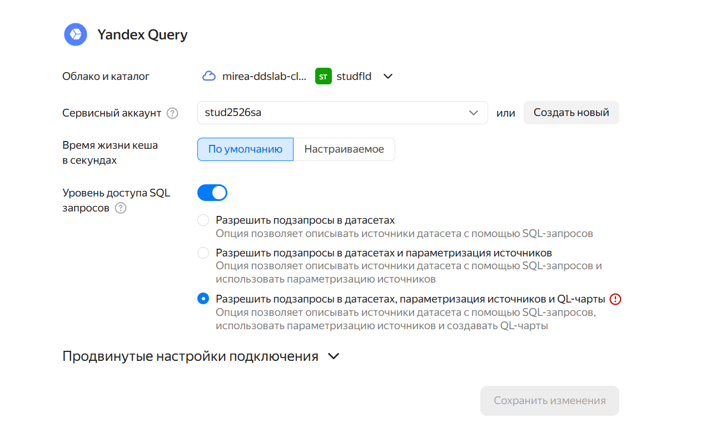
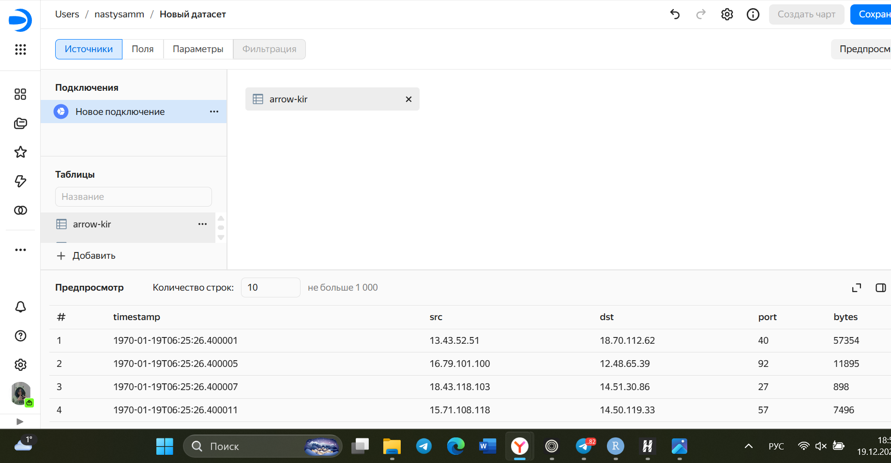
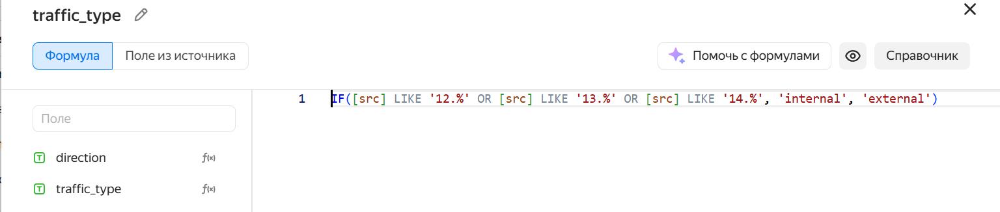
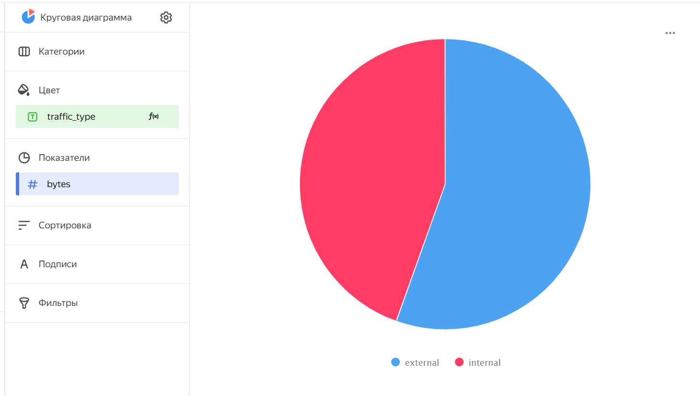
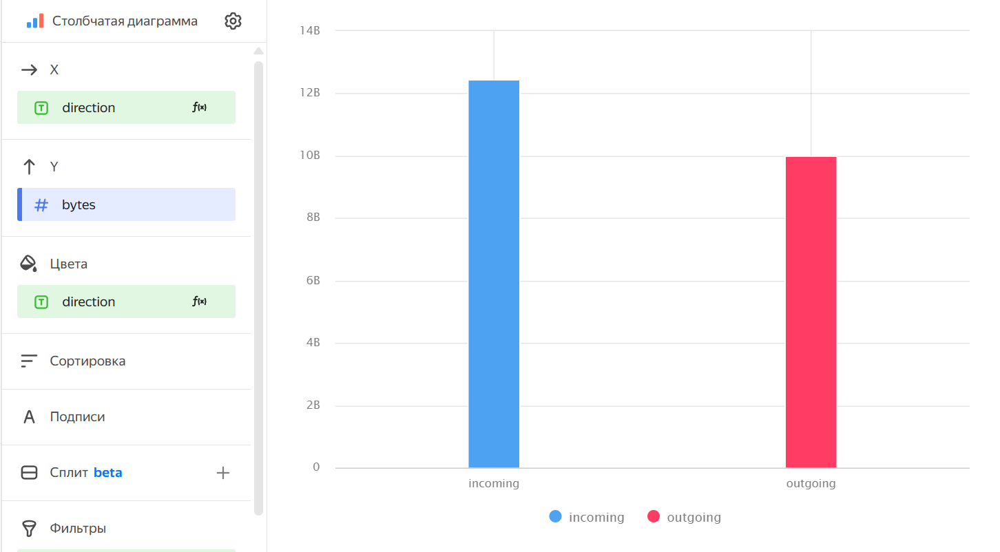
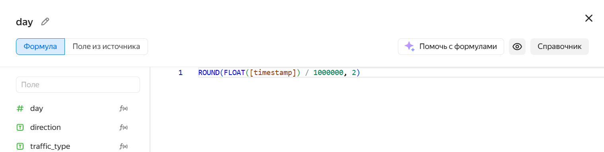
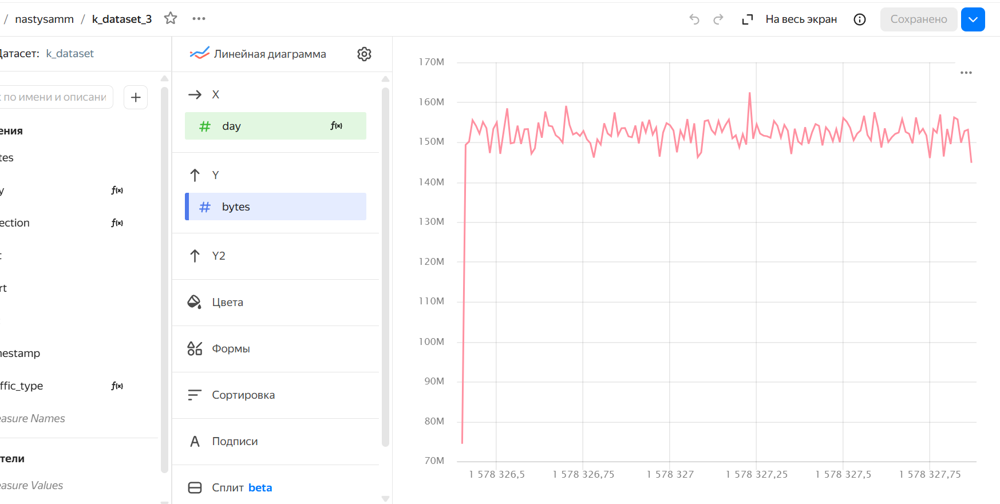

# Использование технологии Yandex DataLens для анализа данных сетевой
активности


## Цель работы

1.  Изучить возможности технологии Yandex DataLens для визуального
    анализа структурированных наборов данных
2.  Получить навыки визуализации данных для последующего анализа с
    помощью сервисов Yandex Cloud
3.  Получить навыки создания решений мониторинга/SIEM на базе облачных
    продуктов и открытых программных решений
4.  Закрепить практические навыки использования SQL для анализа данных
    сетевой активности в сегментированной корпоративной сети

## Исходные данные

1.  Облачное решение для анализа данных Yandex DataLens

## План

1.  Настроить подключение к Yandex Query из DataLens
2.  Создать из запроса YandexQuery датасет DataLens
3.  Делаем нужные графики и диаграммы

## Шаги:

``` r
sessionInfo()
```

    R version 4.5.1 (2025-06-13 ucrt)
    Platform: x86_64-w64-mingw32/x64
    Running under: Windows 11 x64 (build 26100)

    Matrix products: default
      LAPACK version 3.12.1

    locale:
    [1] LC_COLLATE=Russian_Russia.utf8  LC_CTYPE=Russian_Russia.utf8   
    [3] LC_MONETARY=Russian_Russia.utf8 LC_NUMERIC=C                   
    [5] LC_TIME=Russian_Russia.utf8    

    time zone: Europe/Moscow
    tzcode source: internal

    attached base packages:
    [1] stats     graphics  grDevices utils     datasets  methods   base     

    loaded via a namespace (and not attached):
     [1] compiler_4.5.1    fastmap_1.2.0     cli_3.6.5         tools_4.5.1      
     [5] htmltools_0.5.8.1 rstudioapi_0.17.1 yaml_2.3.10       rmarkdown_2.30   
     [9] knitr_1.50        jsonlite_2.0.0    xfun_0.53         digest_0.6.37    
    [13] rlang_1.1.6       evaluate_1.0.5   

##Настроить подключение к Yandex Query из DataLens 

## Создать из запроса YandexQuery датасет DataLens

 \## Делаем нужные графики и диаграммы 1. Представить в
виде круговой диаграммы соотношение внешнего и внутреннего сетевого
трафика. 
 2. Представить в виде столбчатой диаграммы соотношение
входящего и исходящего трафика из внутреннего сетвого сегмента.   3. Построить
график активности (линейная диаграмма) объема трафика во времени.




## Вывод

В ходе выполнения практической работы был реализован комплексный
аналитический пайплайн для мониторинга сетевой активности с
использованием облачных сервисов Yandex Cloud. Работа включала несколько
ключевых этапов: настройку доступа к данным в Yandex Object Storage, их
обработку и агрегацию с помощью Yandex Query, а также создание
интерактивной визуализации в Yandex DataLens.
